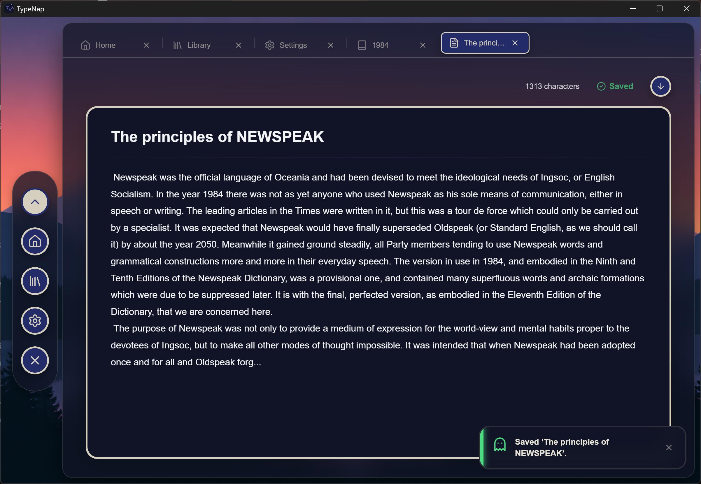

# 👻 TypeNap Open Source

### Your stories deserve a softer place to land.

**A calm, lo-fi writing tool with just enough sparkle to keep the words flowing.**

[](https://github.com/h2depot/TypeNap/issues?q=is%3Aissue+is%3Aopen+label%3Aenhancement)
[](https://github.com/h2depot/TypeNap/issues?q=is%3Aissue+is%3Aopen+label%3Abug)
[](https://github.com/h2depot/TypeNap/blob/main/LICENSE)

**[GUI](#-gui-design)　·　[Build](#-how-to-build-from-github)　·　[Highlights](#-highlights)　·　[Languages](#-languages)　·　[Supported OS](#-supported-os)　·　[Questions & Suggestions](#-questions--suggestions)　·　[License](#-license)　·　[Acknowledgments](#-acknowledgments)**


---

## 🎉 News

 - 2026/9/1 : We have passed the Microsoft Store certification process! The app will be released on September 6th at 12:00 (UTC)!!!!


## 🎃 Welcome to TypeNap

> **Write more. Organize less. Stay in the mood.**

TypeNap is a simple writing tool wrapped in lo-fi pop vibes and a chilled-out, effortless design. It gives stories, drafts, notes, and late-night ideas a cozy home—without turning writing into project management.

This repository contains the open-source TypeNap project. Questions about the internals, suggestions for the source code, and thoughtful contributions are always welcome.

| ✨ THE VIBE | 📚 THE WORKSPACE | 🫧 THE FEELING |
|:---:|:---:|:---:|
| Lo-fi pop atmosphere | Stories and text files together | Lightweight and distraction-free |
| Light and dark themes | Tabs for quick switching | Smooth, expressive motion |
| Custom backgrounds | Backups and restoration | Built for unhurried writing |

## 🖼️ GUI Design

### Soft colors. Clear hierarchy. A little ghostly charm.




---

## 🛠️ How to Build from GitHub

TypeNap is a Tauri application with a React frontend and a Rust backend. To build it from source, install [Git](https://git-scm.com/), [Node.js](https://nodejs.org/), and the [Rust toolchain](https://rustup.rs/) first.

```bash
git clone https://github.com/h2depot/TypeNap.git
cd TypeNap
npm install
```

Run the app in development mode:

```bash
npm run tauri dev
```

Create a release build:

```bash
npm run tauri build
```

`npm` installs and builds the React frontend and the local Tauri CLI. The Tauri CLI invokes Cargo automatically to compile the Rust backend, so a separate `cargo build` command is normally unnecessary. To check only the Rust side, run `cargo check --manifest-path src-tauri/Cargo.toml`.

> [!WARNING]
> ⚠️ **TypeNap currently supports Windows only.** Linux and macOS are not supported at this time. The current project configuration targets a Windows NSIS installer, so the release build must be run on Windows with the required [Tauri prerequisites](https://v2.tauri.app/start/prerequisites/) installed.

## ✨ Highlights

### ⚙️ Generation File Backup System

TypeNap keeps each document's history in a compact JSON backup. The first revision is stored as a complete text snapshot; later saves are recorded as timestamped, line-by-line patches containing only changed, added, or deleted lines. A requested revision can then be reconstructed by replaying those patches over its base snapshot.

To keep reconstruction fast, TypeNap starts a new base generation after 50 incremental revisions. Append-only changes at the beginning of a generation are folded directly into its base snapshot, avoiding needless patch data. Backup growth is also bounded: when a backup file exceeds five times the size of the latest document (with a 1 KiB comparison floor), the oldest base generation is removed while at least one generation is retained.

Deletion protection is handled separately through the **Necropolis**. Before a story or text file is deleted, TypeNap copies its current source text into a retirement directory and records a manifest with its type, original location, and deletion time. Retired items can be listed, restored without overwriting an existing file, or permanently deleted by the user. Restored text receives a fresh generation backup so it immediately returns to the normal protection cycle.

### 🔥 Everything you need, without the noise

- **Story-first organization** — Keep manuscripts and related text files together.
- **A comfortable editor** — Focus on writing in a clean, relaxed workspace.
- **Tabs that stay out of the way** — Move quickly between home, library, stories, and documents.
- **Custom atmosphere** — Choose themes, colors, and background images that fit the moment.
- **Safer writing sessions** — Backup, restore, scan, and deletion-lock tools help protect your work.
- **Keyboard-friendly controls** — Common actions are close at hand through shortcuts.

> [!TIP]
> TypeNap is made for the moment when you want to write—but do not want to wrestle with your writing app first.

## 🌏 Languages

<div align="center">

| 日本語 | English |
|:---:|:---:|
| ✅ Supported | ✅ Supported |

</div>

## 🖥️ Supported OS

> [!WARNING]
> ⚠️ **Attention: TypeNap currently supports Windows only.**
> Linux and macOS are not supported at this time.
> Release builds must be run on Windows with the required [Tauri prerequisites](https://v2.tauri.app/start/prerequisites/) installed.

## 💡 Questions & Suggestions

Found a bug? Have an idea? Want to improve TypeNap?

Please read [CONTRIBUTING.md](https://github.com/h2depot/TypeNap/blob/main/CONTRIBUTING.md), then visit the project pages below.

<div align="center">

[](https://github.com/h2depot/TypeNap/issues)
[](https://github.com/h2depot/TypeNap/issues/new)
[](https://github.com/h2depot/TypeNap/discussions)

</div>

## ⚖️ License

Copyright © 2026 HelloweenHead's Depot. All rights reserved.

TypeNap is licensed under the [GNU Affero General Public License v3.0](https://github.com/h2depot/TypeNap/blob/main/LICENSE). If you distribute a covered work, it must remain available under the applicable copyleft terms of the license.

---

## 💐 Acknowledgments

TypeNap is made possible by excellent open-source projects and the people behind them.

- [**Tauri**](https://github.com/tauri-apps/tauri) — A lightweight, high-performance framework for building desktop applications.
- [**Motion**](https://github.com/motiondivision/motion) — An open-source animation library for JavaScript, React, and Vue.
- **And many more** — React, Lucide, dnd kit, i18next, Zustand, react-hotkeys-hook, and other open-source projects.
- [**Momo Signature**](https://github.com/typeassociates/MomoSignature) — Copyright 2024 The Momo Signature Project Authors. Licensed under the [SIL Open Font License, Version 1.1](https://openfontlicense.org/).
- **AI-generated images** — The images in the initial set were generated with OpenAI Codex.

---

<div align="center">
  
  <br><br>
  <a href="https://github.com/h2depot/TypeNap">
    
  </a>
  <br><br>
  <strong>⭐ Thank you for stopping by TypeNap! ⭐</strong>
  <br>
  <sub>Take a breath. Open a page. Let the story happen.</sub>
</div>
